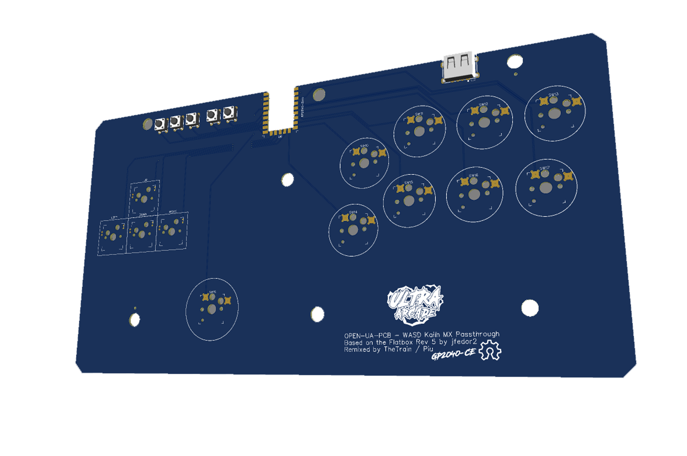

# WASD Kailh MX Passthrough

---

## Attribution

The following text must be included in any distribution of derivatives of this board. All links must also be included.

Based on the Flatbox Rev 5 Passthrough from the GP2040-CE project located at https://github.com/OpenStickCommunity/Hardware/tree/main/Boards/GP2040-CE%20Official%20Controllers/Flatbox%20Rev%205%20Passthrough
Based on the original Flatbox Flatbox Rev 5 project located at https://github.com/jfedor2/flatbox/tree/master/hardware-rev5

Copyright 2024 [Ultra Arcade](https://github.com/Ultra-Arcade)

[Licensed under CC BY 4.0](https://creativecommons.org/licenses/by/4.0/)

Changes from the original design:
  - list any changes you make here

---

## Summary: 

An MX and Kailh mix variant with more space between movement and attack buttons. WASD movement with MX hotswap MX keys, attack buttons with Kailh hotswap keys.

While BOM and CPL files are provided, it is recommended to order and assemble these yourself.

---

## How to order a board

All of the boards so far have been ordered though JLCPCB.  Due to minimum order numbers you would get five of these at a time.  It is not recommended to have these assembed by JLC due to cost.  If you are looking to have them assembled you should check out another project that has an embedded RP2040.

Please note that you will need to source and solder your own Waveshare RP2040-Zero board (or similar), passthrough port, tactile switches and hotswap sockets.

1 - Go to JLCPCB.com 

2 - Click on `Instant Quote` 

3 - Click on `Add Gerber file` and choose the file named `Gerber - WASD Kailh MX Passthrough.zip` from the `Hardware Files` folder 

4 - Choose the following options for the board: 
- Base Material = FR-4 
- Layers = 2 
- Dimensions = (should auto-populate) 210 mm x 120 mm 
- PCB Qty = (however large your run will be, minimum of 5) 
- Product Type = Industrial/Consumer electronics 
- Different Design = 1 
- Delivery Format = Single PCB 
- PCB Thickness = 1.6 
- PCB Color = (up to you) 
- Silkscreen = (defaults to white for all except white boards which is black) 
- Surface Finish = HASL(with lead) 
- Outer Copper Weight = 1oz 
- Via Covering = Tented 
- Board Outline Tolerance = +/- 0.2mm (Regular) 
- Confirm Production file = Yes 
- Remove Order Number = Yes 
- Flying Probe Test = Fully Test 
- Gold Fingers = No 
- Castellated Holes = No 
- No advanced options 

If all looks well here you can click on the `SAVE TO CART` button.

5 - The `Secure Checkout` process will be different based on your location in the world.  We recommend researching your shipping options to choose the one that is right for your application. 

You will need the following parts to assemble the WASD Kailh MX Passthrough:
- 5 x 6x6x7 tactile switches - [LINK](https://www.aliexpress.com/item/1005004159746274.html)
- 1 x Waveshare RP2040 Zero, clone or similar - [LINK](https://www.aliexpress.com/item/1005005910512138.html)
- 1 x Mid-mount USB passthrough port - [LINK](https://www.aliexpress.com/item/1005005686242161.html)
- 4 x CherryMX Hotswap Sockets - [LINK](https://www.aliexpress.com/item/1005006108246232.html)
- 4 x Cherry MX Switches (5 Pins Preferred) - [LINK](https://www.aliexpress.com/item/1005006452799449.html)
- 4 x Cherry MX Keycaps - [LINK](https://www.aliexpress.com/item/1005006107037094.html)
- 9 x Kailh Hotswap Sockets - [LINK](https://www.aliexpress.com/item/1005004916925259.html)
- 9 x Kailh Choc V2 Switches - [LINK](https://www.aliexpress.com/item/1005005066626541.html)
- 9 x Kailh Choc V2 Round Keycaps - [LINK](https://www.aliexpress.com/item/1005004526308262.html)
- 11 x M4 Rivet Nuts - [LINK](https://www.aliexpress.com/item/1005005242016053.html)
- 11 x M4x10 Bolts - [LINK](https://www.aliexpress.com/item/1005005493205421.html)

---

Attribution:

The main PCB was redesigned by Ultra Arcade in EasyEDA.  All source files for this are located in the `Source Files` folder.

The initial Flatbox design was made by Jfedor. A remix was then designed by TheTrain. Our version is a remix from TheTrain's version of the pcb.

---
